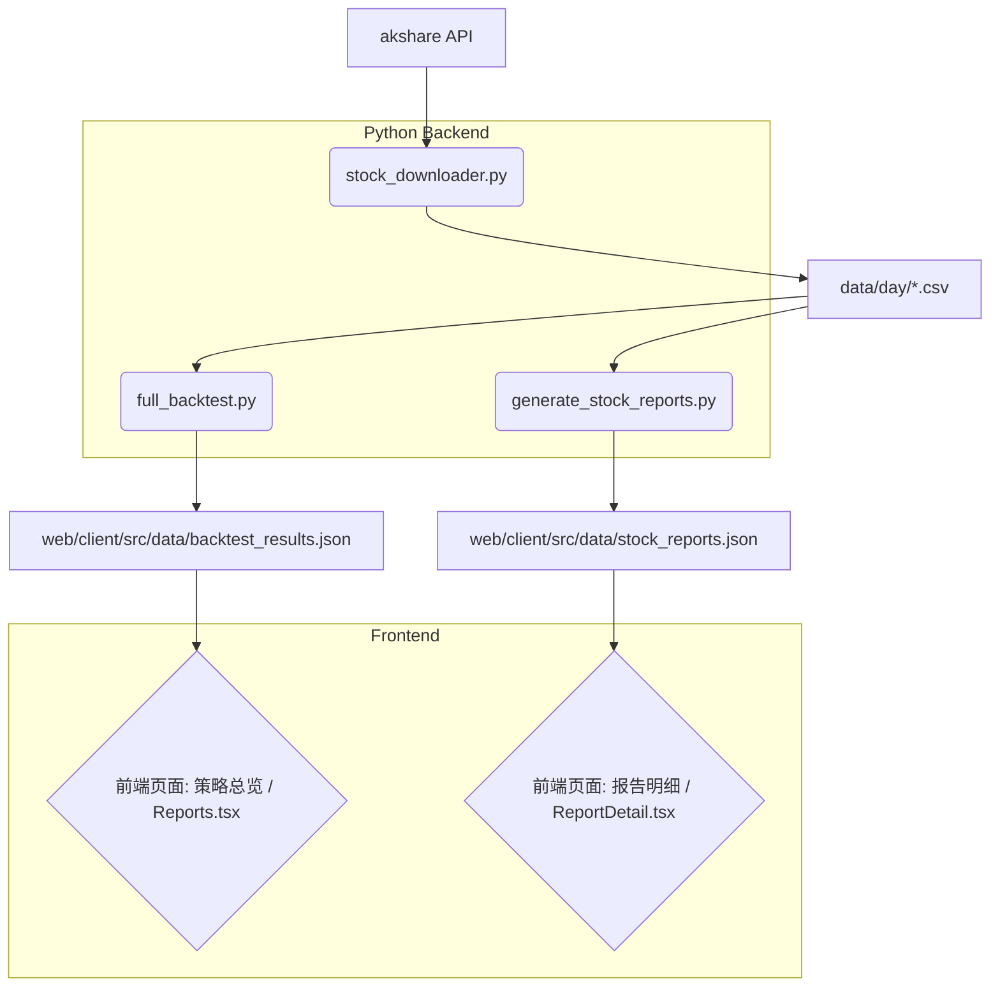

# 回测系统详细开发说明文档

> **版本**: 4.1.0
> **更新日期**: 2026-01-11
> **作者**: Manus AI

---

## 1. 项目愿景与架构

### 1.1 核心目标

本系统旨在为量化交易爱好者和开发者提供一个**高度可复刻、可扩展的A股技术指标回测平台**。其核心价值在于将经典的“通达信”指标逻辑通过代码实现，并提供一套完整的数据处理、回测、可视化流程，让策略验证和二次开发变得简单高效。

### 1.2 系统架构

系统采用**“离线计算 + 静态展示”**的架构，这是一种兼具高性能和低成本的解决方案。

*   **离线计算 (Python Backend)**: 后端通过 Python 脚本负责所有重计算任务，包括从 `akshare` 下载数据、清洗、计算上百种技术指标、执行策略回测，并最终将结果序列化为 JSON 文件。
*   **静态展示 (React Frontend)**: 前端是一个纯粹的静态网站（由 Vite 构建），它不依赖动态服务器，而是直接读取后端生成的 JSON 文件来渲染图表和表格。这种模式使得前端可以轻松部署在任何静态托管服务上（如 Vercel, Netlify, 或 Nginx）。

**数据流转图:**



---

## 2. 核心模块深度解析

### 2.1 目录结构

一个清晰的目录结构是项目可维护性的基石。

```text
tdx-strategy-backtest/
├── data/                      # 数据中心
│   └── day/                   # 股票日线数据 (按 sh, sz, bj 市场分子目录存放)
├── py_file/                   # Python 后端核心
│   ├── stock_downloader.py    # 多功能数据下载器
│   ├── indicators.py          # 指标计算引擎 (项目的“数学灵魂”)
│   ├── full_backtest.py       # 策略统计回测引擎 (生成策略排行榜数据)
│   ├── generate_stock_reports.py # 个股报告生成器 (生成股票明细数据)
│   ├── update_web_data.py     # 数据同步脚本
│   ├── fix_stock_names.py     # 股票名称修复脚本
│   └── 10x_.../20x_...       # 各类单策略或组合策略的测试脚本
├── web/                       # 前端应用 (Vite + React)
│   ├── client/src/            # 前端源码
│   │   ├── pages/             # 核心页面组件 (如 ReportDetail.tsx)
│   │   ├── components/        # 可复用UI组件
│   │   └── data/              # 关键数据接口 (由Python生成的JSON文件)
│   └── package.json           # 前端依赖与脚本配置
├── deploy/                    # 自动化部署脚本 (如 systemd timer)
├── venv/                      # Python 虚拟环境 (本地生成)
├── requirements.txt           # Python 依赖清单
├── 项目部署手册.md            # 本文档
└── 回测系统详细开发说明.md    # 本文档
```

### 2.2 后端引擎 (`py_file/`)

`py_file/` 目录包含了所有处理数据、计算指标和执行回测的 Python 脚本。它们是整个系统的“大脑”，负责生成前端所需的所有数据。

#### `stock_downloader.py` - 数据生命线

*   **功能**: 此脚本是整个系统的数据源头，负责从 `akshare` 获取并维护本地的股票数据副本。
*   **核心逻辑**: 
    *   支持 `--full` (全量) 和 `--incremental` (增量) 两种模式，能够智能地创建和更新本地超过5000个股票的CSV文件。
    *   通过 `ak.stock_zh_a_spot_em()` 获取所有A股代码列表。
    *   自动检测并记录长期不交易的股票到 `config/skip_stocks.json`，避免在每日更新中浪费API请求和时间。
    *   下载的数据按市场（`sh`, `sz`, `bj`）分子目录存放于 `data/day/` 目录下，每个股票一个CSV文件，例如 `data/day/sh/600000.csv`。
*   **数据输出**: `data/day/*.csv` (包含股票代码、名称、日期、开盘、收盘、最高、最低、成交量等)。
*   **对前端的影响**: `stock_downloader.py` 间接影响前端，因为它提供了所有回测和报告生成所需的基础数据。如果数据未下载或不完整，后续的回测和报告将无法生成，导致前端页面无数据或数据陈旧。

#### `indicators.py` - 指标计算核心

*   **功能**: 这是整个项目技术含量的核心，它将通达信的公式语言（如 `MA`, `REF`, `CROSS`）用纯 Python 和 Pandas 进行了复现，为策略回测提供基础。
*   **核心逻辑**: 
    *   实现了 `EMA`, `SMA`, `HHV`, `LLV`, `REF`, `CROSS` 等通达信基础函数，是构建任何复杂指标的基石。
    *   在基础函数之上，封装了如 `calculate_six_veins` (六脉神剑), `calculate_buy_sell_points` (买卖点) 等高级策略。
    *   每个函数接收一个 Pandas DataFrame 作为输入，计算相应的技术指标，并将结果作为新列添加到 DataFrame 中返回。
*   **数据输出**: 不直接输出文件，而是为其他脚本（如 `full_backtest.py` 和 `generate_stock_reports.py`）提供带有计算指标的 DataFrame。
*   **对前端的影响**: `indicators.py` 定义了所有策略的计算逻辑。前端展示的所有策略结果（如胜率、收益率、信号类型）都来源于此脚本定义的指标。任何策略的修改或新增都将在此脚本中进行，并最终体现在前端的报告中。

#### `full_backtest.py` - 策略统计回测引擎

*   **功能**: 遍历所有股票数据，针对**多种策略**进行回测，计算其在总、年、月维度下的胜率和收益，生成策略排行榜数据。
*   **核心逻辑**: 
    *   读取 `data/day/*.csv` 中的股票数据。
    *   调用 `indicators.py` 中的函数计算各种策略信号。
    *   对每个策略在每只股票上进行模拟交易，统计交易结果（买入日期、卖出日期、收益、胜负）。
    *   汇总所有股票和所有策略的回测结果，计算总收益、总胜率、年收益、年胜率、月收益、月胜率等关键指标。
*   **数据输出**: `web/client/src/data/backtest_results.json`。此 JSON 文件包含一个列表，每个元素代表一个策略的汇总回测统计数据。
*   **对前端的影响**: `backtest_results.json` 是前端 **“策略总览”** 页面 (`web/client/src/pages/Reports.tsx` 或类似页面) 的数据源。该页面会展示所有策略的排行榜，用户可以根据不同的统计指标（如总收益、胜率）进行排序和筛选，从而快速评估不同策略的表现。

#### `generate_stock_reports.py` - 个股报告生成器

*   **功能**: 遍历所有股票，为**每一只股票**生成一个总的回测报告（综合所有策略的表现），并产出详细的股票明细数据。
*   **核心逻辑**: 
    *   读取 `data/day/*.csv` 中的股票数据。
    *   调用 `indicators.py` 中的函数计算所有策略信号。
    *   对每只股票，统计其在所有策略下的表现，包括总收益、年收益、月收益、总胜率、年胜率、月胜率、交易次数以及最新的交易信号。
    *   将每只股票的详细报告汇总成一个列表。
*   **数据输出**: `web/client/src/data/stock_reports.json`。此 JSON 文件包含一个列表，每个元素代表一只股票的详细回测报告。
*   **对前端的影响**: `stock_reports.json` 是前端 **“报告明细”** 页面 (`web/client/src/pages/ReportDetail.tsx`) 的数据源。该页面会以表格形式展示所有股票的详细回测数据，用户可以搜索特定股票、按市场筛选、按各项指标排序，并导出CSV，提供了类似Excel的交互体验。

#### `update_web_data.py` - 数据同步脚本

*   **功能**: 这是一个辅助脚本，用于确保所有后端生成的 JSON 数据文件被正确地放置在前端项目所需的 `web/client/src/data/` 目录下。
*   **核心逻辑**: 复制或移动 `full_backtest.py` 和 `generate_stock_reports.py` 生成的 JSON 文件到前端指定目录。
*   **数据输出**: 将 `backtest_results.json` 和 `stock_reports.json` 复制到 `web/client/src/data/`。
*   **对前端的影响**: 确保前端能够读取到最新的回测数据。如果此脚本未运行，即使后端生成了最新数据，前端也可能因为读取不到正确路径的文件而显示旧数据或无数据。

#### `fix_stock_names.py` - 股票名称修复脚本

*   **功能**: 修复 `stock_reports.json` 中股票名称显示不正确的问题，将其替换为从原始CSV文件中读取的真实股票名称。
*   **核心逻辑**: 
    *   读取 `web/client/src/data/stock_reports.json`。
    *   对于每条记录，根据股票代码和市场，从 `data/day/{market}/{code}.csv` 中读取第一行的“名称”字段。
    *   用真实名称更新 `stock_reports.json` 中的 `name` 字段。
*   **数据输出**: 更新后的 `web/client/src/data/stock_reports.json`。
*   **对前端的影响**: 确保前端“报告明细”页面 (`web/client/src/pages/ReportDetail.tsx`) 和其他可能显示股票名称的组件能够正确展示股票的中文名称，提升用户体验和数据准确性。

### 2.3 前端系统 (`web/`)

前端采用现代化的技术栈，提供了流畅的用户体验。它通过直接读取后端生成的 JSON 文件来渲染数据。

*   **技术栈**: Vite + React 19 + TypeScript + TailwindCSS + shadcn/ui + Recharts。
*   **数据消费**: 前端组件通过简单的 `import` 语句直接加载 `web/client/src/data/` 下的 JSON 文件。例如，在 `ReportDetail.tsx` 中：
    ```typescript
    import stockReportsData from "@/data/stock_reports.json";
    ```
    这种方式极大地简化了数据传递，避免了复杂的API请求和状态管理。
*   **核心页面 (`web/client/src/pages/`)**: 
    *   **`Reports.tsx`**: 主要展示策略总览和排行榜。它消费 `web/client/src/data/backtest_results.json`，将不同策略的汇总表现（如总收益、胜率）以图表和表格形式呈现。
    *   **`ReportDetail.tsx`**: 负责展示个股的详细回测报告。它消费 `web/client/src/data/stock_reports.json`，提供股票代码/名称搜索、市场筛选、多列排序和CSV导出功能，是用户深入分析个股表现的核心界面。
    *   **`Overview.tsx`**: 可能展示整体回测概览或关键指标。它也可能消费 `backtest_results.json` 或其他汇总数据。
*   **可复用组件 (`web/client/src/components/`)**: 包含各种 UI 组件，如表格、卡片、按钮等，用于构建页面布局和交互元素。

---

## 3. 如何复刻与二次开发

遵循以下步骤，任何开发者都可以轻松地在本地复刻、运行甚至扩展此项目。

### 3.1 复刻流程

1.  **环境准备**: 确保你的机器上已安装 Python 3.11+ 和 Node.js 18+。
2.  **克隆与安装**: 按照 `项目部署手册.md` 的指引，完成项目克隆、Python依赖安装 (`pip install -r requirements.txt`) 和前端依赖安装 (`pnpm install`)。
3.  **数据下载**: 激活虚拟环境，进入 `py_file` 目录，执行 `python stock_downloader.py --full`。等待其完成。
4.  **生成报告**: 继续在 `py_file` 目录下，依次执行 `python full_backtest.py` 和 `python generate_stock_reports.py`。
5.  **启动前端**: 进入 `web` 目录，运行 `pnpm dev`。
6.  **访问**: 打开浏览器，访问 `http://localhost:5173`。

至此，你已在本地完整复刻了整个项目。

### 3.2 如何添加一个新策略？

这是二次开发中最常见的需求。流程被设计得非常简单：

1.  **定义指标**: 在 `py_file/indicators.py` 中，仿照现有函数（如 `calculate_six_veins`），编写你的新策略计算逻辑。函数必须接收一个 DataFrame 并返回一个添加了新指标列（通常是布尔值的买入信号，如 `new_strategy_buy`）的 DataFrame。

2.  **注册策略**: 打开 `py_file/full_backtest.py`，在 `signal_types` 列表中加入你的新策略ID（例如 `new_strategy_buy`）。

3.  **运行回测**: 重新运行 `python full_backtest.py` 和 `python generate_stock_reports.py`，你的新策略就会被计算并包含在生成的 JSON 文件中。

4.  **前端展示**: 刷新你的 Web 界面。由于前端是动态读取 JSON 的，你的新策略将自动出现在策略列表和统计中，无需修改任何前端代码。

### 3.3 如何修复股票名称显示问题？

**问题描述**: 当前 `stock_reports.json` 中的股票名称可能被硬编码为 `沪市xxxxxx` 或 `深市xxxxxx`，而不是CSV文件中实际的股票名称（如“浦发银行”）。

**解决方案**: 这个问题的根源在于 `generate_stock_reports.py` 脚本在生成 `stock_reports.json` 时，没有正确地从原始数据中提取股票名称。我们已经通过 `fix_stock_names.py` 脚本解决了这个问题。如果你需要手动修复或理解其原理，可以参考以下步骤：

1.  **定位问题代码**: 在 `generate_stock_reports.py` 中找到生成报告字典的部分。

2.  **读取真实名称**: 在加载股票数据 `df = load_stock_data(stock_file)` 之后，股票的真实名称已经存在于 `df["名称"]` 这一列。我们只需要在构建报告时正确地引用它。

3.  **修改代码**: 找到构建 `report` 字典的地方，将 `"name"` 字段的赋值逻辑修改为从 DataFrame 中直接读取。脚本 `generate_stock_reports.py` 中的 `get_stock_name` 函数已经提供了这个能力。

    ```python
    # 在 generate_stock_reports.py 中
    # ...
    df = load_stock_data(stock_file)
    # ...
    # 获取股票名称
    stock_name = get_stock_name(stock_code, df)
    # ...
    # 构建报告字典时
    report = {
        'code': stock_code,
        'name': stock_name, # <-- 确保使用这里获取的真实名称
        # ... 其他字段
    }
    ```

4.  **重新生成**: 保存修改后，重新运行 `python generate_stock_reports.py`，生成的 `stock_reports.json` 文件中的股票名称就会被正确更新。或者直接运行 `fix_stock_names.py` 脚本进行批量修复。
