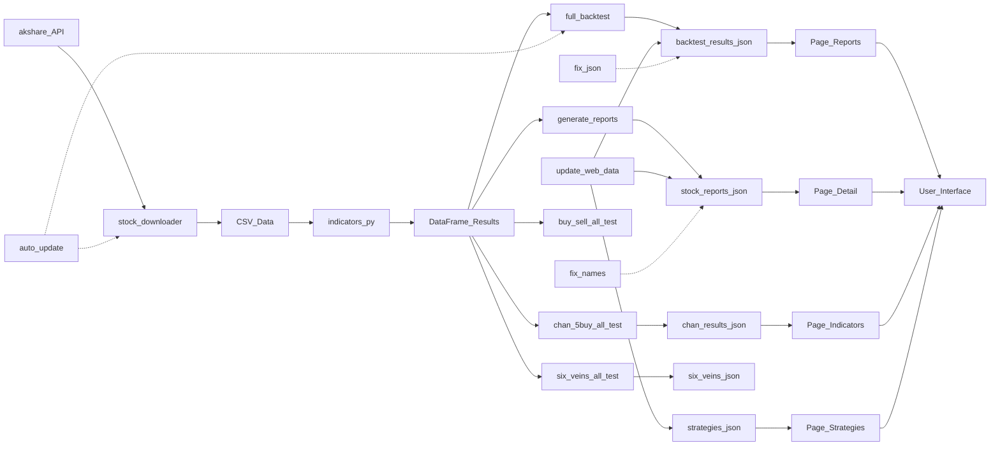

# 股票指标回测系统详细开发说明

> **版本**: 5.2.0
> **更新日期**: 2026-01-12
> **作者**: Manus AI

---

## 1. 项目愿景与架构

### 1.1 核心目标

本系统旨在为量化交易爱好者和开发者提供一个**高度可复刻、可扩展的A股技术指标回测平台**。其核心价值在于将经典的“通达信”指标逻辑通过代码实现，并提供一套完整的数据处理、回测、可视化流程，让策略验证和二次开发变得简单高效。

### 1.2 系统架构

系统采用**“离线计算 + 静态展示”**的架构，这是一种兼具高性能和低成本的解决方案。

*   **离线计算 (Python Backend)**: 后端通过 Python 脚本负责所有重计算任务，包括从 `akshare` 下载数据、清洗、计算上百种技术指标、执行策略回测，并最终将结果序列化为 JSON 文件。
*   **静态展示 (React Frontend)**: 前端是一个纯粹的静态网站（由 Vite 构建），它不依赖动态服务器，而是直接读取后端生成的 JSON 文件来渲染图表和表格。这种模式使得前端可以轻松部署在任何静态托管服务上（如 Vercel, Netlify, 或 Nginx）。

**数据流转图 (超详细版):**

---

## 2. 核心模块深度解析

### 2.1 数据获取与预处理

系统的数据流从 `akshare` 开始。`stock_downloader.py` 是整个系统的“水源”，它负责将网络上的原始行情数据转化为本地的 CSV 文件。

*   **增量更新机制**: 脚本会检查本地已有的数据日期，仅下载缺失的部分并进行合并，极大地节省了带宽和时间。
*   **自动跳过逻辑**: 对于长期停牌或退市的股票，系统会自动将其加入跳过列表，避免无效的尝试。

### 2.2 策略回测引擎

`full_backtest.py` 是系统的核心大脑。它通过多进程并行计算，遍历数千只股票的历史数据。

*   **指标计算**: 依赖 `indicators.py`，将通达信公式转化为高性能的 Pandas 向量化运算。
*   **信号触发**: 策略逻辑会扫描 DataFrame，识别出买入和卖出信号。
*   **统计分析**: 计算胜率、平均收益、最大回撤、最优持仓周期等关键量化指标。

### 2.3 前端展示系统

前端采用 React + TailwindCSS 构建，通过 `Vite` 进行极速打包。

*   **零后端依赖**: 前端直接通过 `import` 导入 JSON 数据，无需运行任何 API 服务器。
*   **交互式图表**: 使用 `Recharts` 渲染收益曲线和分布图。
*   **高性能列表**: 支持对数千条回测记录进行即时搜索、筛选和排序。

---

## 3. 如何复刻与二次开发

### 3.1 复刻流程

1.  **环境准备**: 安装 Python 3.11+ 和 Node.js 18+。
2.  **安装依赖**: `pip install -r requirements.txt` 和 `pnpm install`。
3.  **下载数据**: `python py_file/stock_downloader.py --full`。
4.  **运行回测**: `python py_file/full_backtest.py`。
5.  **启动 Web**: `cd web && pnpm dev`。

### 3.2 添加新策略

1.  在 `py_file/indicators.py` 中编写指标逻辑。
2.  在 `py_file/full_backtest.py` 的策略列表中注册新策略。
3.  重新运行回测脚本并刷新网页。
