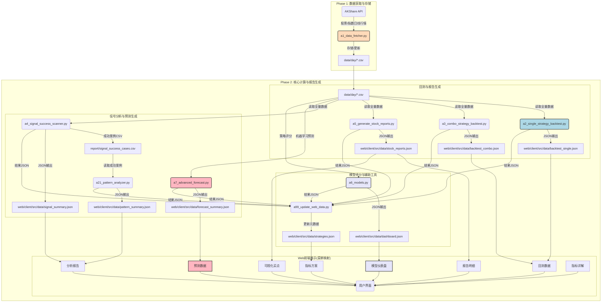

# 股票策略回测与分析系统 - 详细开发说明文档

**版本**: 6.0.0
**更新日期**: 2026-01-20
**作者**: Manus AI

---

## 1. 系统架构与设计哲学

### 1.1. 核心设计原则

本系统采用 **“离线计算 + 静态展示”** 的架构，旨在实现高性能、低成本、高可扩展性的量化研究平台。

| 原则 | 描述 | 实现方式 |
| :--- | :--- | :--- |
| **高性能** | 充分利用多核CPU资源，加速数据处理和回测。 | Python `multiprocessing` 模块，并行数量设置为 `CPU核心数 - 1`。 |
| **低耦合** | 前后端通过静态JSON文件交换数据，完全解耦。 | 后端脚本直接输出JSON到前端数据目录，前端通过 `fetch` 动态读取。 |
| **自动化** | 脚本设计旨在实现最大程度的自动化，如自动数据更新、报告生成和Web数据同步。 | `a0_auto_update_daily.py` 脚本实现一键式全流程更新。 |

### 1.2. 脚本命名规范

为提高可维护性，所有脚本已按功能重新命名：

| 前缀 | 范围 | 脚本类型 | 示例 |
| :--- | :--- | :--- | :--- |
| **a0** | 00-09 | 定时任务脚本 | `a0_auto_update_daily.py` |
| **a1** | 10-19 | 数据下载脚本 | `a1_data_fetcher.py` |
| **a2** | 20-29 | 回测主脚本 | `a2_single_strategy_backtest.py` |
| **a3** | 30-39 | 组合策略回测脚本 | `a3_combo_strategy_backtest.py` |
| **a4** | 40-49 | 分析主脚本 | `a4_signal_success_scanner.py` |
| **a5** | 50-59 | 报告生成脚本 | `a5_generate_stock_reports.py` |
| **a6** | 60-69 | AI模型评分脚本 | `a6_models.py` |
| **a7** | 70-79 | 高级预测分析脚本 | `a7_advanced_forecast.py` |
| **a21** | 210-219 | 分析子脚本 | `a21_pattern_analyzer.py` |
| **a99** | 990-999 | 辅助/工具库脚本 | `a99_indicators.py` |

### 1.3. 数据流线图 (完整Web菜单映射)

本图清晰展示了数据从外部API到最终Web页面的完整生命周期，并映射到Web界面的所有菜单项。

---

## 2. 后端模块功能点详细解析 (`py_file/`)

### 2.1. 定时任务脚本

| 脚本名称 | 功能作用 | 详细说明 |
| :--- | :--- | :--- |
| **`a0_auto_update_daily.py`** | **每日全流程自动化** | 这是一个协调脚本，用于定时任务（如 `crontab`）。它按顺序调用所有核心脚本，实现 **数据下载 -> 回测 -> 分析 -> 模型评分 -> 预测分析 -> Web数据同步** 的一键式自动化更新。 |

### 2.2. 数据下载脚本

| 脚本名称 | 功能作用 | 详细说明 |
| :--- | :--- | :--- |
| **`a1_data_fetcher.py`** | **数据获取与管理** | 负责从 `AKShare` 获取股票和指数的日线数据，并存储为CSV文件。支持 `--full` (全量)、`--today` (当日增量)、`--date` (日期范围覆盖) 三种模式。 |

### 2.3. 回测与分析脚本

| 脚本名称 | 功能作用 | 详细说明 |
| :--- | :--- | :--- |
| **`a2_single_strategy_backtest.py`** | **单指标策略回测** | 运行六脉神剑、缠论、买卖点等单指标策略的回测，输出回测结果JSON文件。 |
| **`a3_combo_strategy_backtest.py`** | **组合策略回测** | 运行稳健型、激进型等组合策略的回测，输出回测结果JSON文件。 |
| **`a4_signal_success_scanner.py`** | **信号成功案例扫描** | 扫描全市场历史数据，识别特定买入信号，并验证其后15日涨幅是否超过5%，筛选出成功案例。输出成功案例CSV和信号统计JSON。 |
| **`a21_pattern_analyzer.py`** | **成功案例模式分析** | 读取 `a4` 脚本筛选出的成功案例，分析信号发生当天，其他技术指标（MACD, KDJ, BOLL等）和市场理论（道氏、威科夫）的状态，找出共性模式。 |
| **`a5_generate_stock_reports.py`** | **个股报告生成** | 为每只股票生成详细的回测报告，包含K线图买卖点标注数据，供前端“报告明细”和“可视化买点”模块使用。 |

### 2.4. AI模型与预测脚本

| 脚本名称 | 功能作用 | 详细说明 |
| :--- | :--- | :--- |
| **`a6_models.py`** | **AI模型评分系统** | 整合多个策略槽的信号，对全市场股票进行综合评分和排名，生成模型仪表盘数据。 |
| **`a7_advanced_forecast.py`** | **高级预测分析** | 使用卡尔曼滤波、隐马尔可夫模型(HMM)和随机森林等集成算法，对股票未来走势进行预测，生成预测数据。 |

### 2.5. 辅助/工具库脚本

| 脚本名称 | 功能作用 | 详细说明 |
| :--- | :--- | :--- |
| **`a99_indicators.py`** | **技术指标库** | 封装所有技术指标（MACD, KDJ, 缠论等）的计算逻辑。所有策略和分析脚本都依赖此库进行指标计算。 |
| **`a99_backtest_utils.py`** | **回测工具库** | 封装多进程并行处理、结果汇总、数据读取等通用回测辅助功能。 |
| **`a99_update_web_data.py`** | **Web数据同步** | 负责将回测结果汇总并更新到前端的元数据文件 `strategies.json`，驱动 **指标方案** 菜单的数据展示。 |

---

## 3. Web前端功能与数据来源

前端应用基于 React 构建，通过读取后端脚本生成的静态 JSON 文件进行数据展示。

| 网页菜单 | 网页功能作用 | 数据来源脚本 | 数据来源文件 |
| :--- | :--- | :--- | :--- |
| **回测数据** | 展示单策略和组合策略的收益曲线、胜率、最大回撤等核心绩效指标。 | `a2_single_strategy_backtest.py` / `a3_combo_strategy_backtest.py` | `backtest_single.json`, `backtest_combo.json` |
| **分析报告** | 展示信号成功率统计、六脉神剑组合分析、成功案例的技术指标共性模式统计。 | `a4_signal_success_scanner.py` / `a21_pattern_analyzer.py` | `signal_summary.json`, `pattern_summary.json` |
| **报告明细** | 提供按股票代码查询的详细回测报告列表，展示个股的交易记录和绩效。 | `a5_generate_stock_reports.py` | `stock_reports.json` |
| **可视化买点** | 在K线图上直观标注策略识别出的买入和卖出点，用于策略验证和教学。 | `a5_generate_stock_reports.py` | `stock_reports.json` |
| **指标方案** | 展示系统内置的策略方案列表，包含策略描述、配置参数和最新的回测统计摘要。 | `a99_update_web_data.py` | `strategies.json` |
| **模型仪表盘** | 展示基于多策略整合的 AI 模型评分排名和市场综合表现。 | `a6_models.py` | `dashboard.json` |
| **预测数据** | 展示基于机器学习算法（卡尔曼滤波、HMM等）的股票未来走势预测和置信度分析。 | `a7_advanced_forecast.py` | `forecast_summary.json` |
| **指标详解** | 提供系统内置的各种技术指标（MACD, KDJ, 缠论等）的计算公式、原理和使用说明。 | `a99_indicators.py` (逻辑) | 静态内容 / 前端逻辑 |

---

**文档结束**
