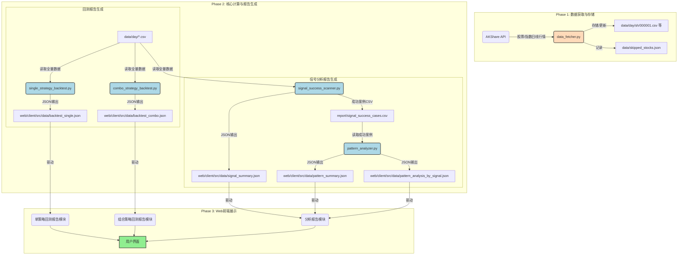

# 股票策略回测与分析系统 - 详细开发说明文档

**版本**: 3.0.0
**更新日期**: 2026-01-16
**作者**: Manus AI

---

## 1. 系统架构与设计哲学

### 1.1. 核心设计原则

本系统采用 **“离线计算 + 静态展示”** 的架构，旨在实现高性能、低成本、高可扩展性的量化研究平台。

| 原则 | 描述 | 实现方式 |
| :--- | :--- | :--- |
| **高性能** | 充分利用多核CPU资源，加速数据处理和回测。 | Python `multiprocessing` 模块，并行数量设置为 `CPU核心数 - 1`。 |
| **低耦合** | 前后端通过静态JSON文件交换数据，完全解耦。 | 后端脚本直接输出JSON到前端数据目录，前端通过 `import` 读取。 |
| **可扩展性** | 策略和指标的添加不影响核心框架。 | 策略逻辑封装在独立的函数中，指标计算集中在 `indicators.py`。 |
| **自动化** | 减少人工干预，实现一键式数据更新和报告生成。 | `data_fetcher.py` 支持 `--full` / `--today` 模式，脚本自动输出到Web目录。 |

### 1.2. 修复后的数据流线图

本图清晰展示了数据从外部API到最终Web页面的完整生命周期和流转路径。

---

## 2. 后端模块功能点详细解析 (`py_file/`)

### 2.1. `data_fetcher.py` - 数据获取模块

| 功能点 | 详细说明 | 命令行参数 |
| :--- | :--- | :--- |
| **全量下载** | 首次运行或需要完整数据时使用，下载所有A股和指数的历史日线数据。 | `--full` |
| **当日更新** | 仅下载最新的交易日数据，并追加到本地CSV文件。适用于日常维护。 | `--today` |
| **日期范围覆盖** | 下载指定日期范围的数据，并**覆盖**本地CSV文件中该时间段的数据。用于数据修复或回溯测试特定时间段。 | `--date YYYYMMDD YYYYMMDD` |
| **并行处理** | 使用多进程并行下载，提高效率。并行数量设置为 `CPU核心数 - 1`。 | N/A |

### 2.2. `indicators.py` - 技术指标计算模块

该模块是所有策略和分析的基础，封装了所有技术指标的计算逻辑。

| 指标类型 | 包含指标 | 核心逻辑 |
| :--- | :--- | :--- |
| **趋势指标** | MACD, DMI, DMA, SAR, BBI | 向量化计算，确保与通达信公式结果一致。 |
| **震荡指标** | KDJ, RSI, WR, CCI | 包含平滑处理（如KDJ的J值计算）和边界处理。 |
| **能量指标** | OBV, 成交量/额 | 基于成交量和价格变动的累积计算。 |
| **通道指标** | BOLL | 基于标准差的通道计算。 |
| **缠论结构** | 笔、线段、中枢、分型 | 复杂的递归和迭代逻辑，用于识别缠论的底层结构。 |

### 2.3. `single_strategy_backtest.py` - 单策略回测模块

该脚本整合了原101-105系列脚本，通过命令行参数选择运行。

| 策略名称 | 策略ID | 核心逻辑 |
| :--- | :--- | :--- |
| **六脉神剑** | `six_veins` | 基于6个指标（如MACD, KDJ, RSI等）的颜色状态组合进行买入判断。 |
| **买卖点** | `buy_sell` | 基于价格与均线（如5日、10日）的交叉和形态进行买入（买点1/2）判断。 |
| **缠论买点** | `chan` | 识别缠论的5类标准买点（一买、二买、三买、强二买、类二买）。 |
| **卖出优化** | `sell_optimize` | 分析不同持仓天数（如5日、10日、15日）对策略收益的影响。 |

### 2.4. `combo_strategy_backtest.py` - 组合策略回测模块

该脚本整合了原201-202系列脚本，用于多指标组合策略的验证。

| 策略名称 | 策略ID | 核心逻辑 |
| :--- | :--- | :--- |
| **稳健组合** | `steady` | 采用多重过滤条件，如MACD金叉、KDJ低位、BOLL缩口等，追求高胜率。 |
| **激进组合** | `aggressive` | 采用较少过滤条件，追求高爆发力，但回撤可能较大。 |

### 2.5. `signal_success_scanner.py` - 信号成功案例扫描器

| 功能点 | 详细说明 | 输出文件 |
| :--- | :--- | :--- |
| **信号识别** | 识别六脉神剑（4红以上）、缠论5类买点、买卖点（买点1/2）三种信号。 | N/A |
| **绩效验证** | 计算信号日后15个交易日内的最高涨幅。 | N/A |
| **成功筛选** | 仅记录涨幅超过 **5%** 的信号为成功案例。 | `report/signal_success_cases.csv` |
| **Web数据输出** | 统计各类信号的成功率、总数等摘要信息。 | `web/client/src/data/signal_summary.json` |

### 2.6. `pattern_analyzer.py` - 成功案例模式分析器

| 功能点 | 详细说明 | 输出文件 |
| :--- | :--- | :--- |
| **指标状态分析** | 针对每个成功案例的**信号发生日**，计算11种技术指标（MACD, KDJ, BOLL, RSI, DMI, DMA, SAR, BBI, OBV, WR, CCI）的状态。 | N/A |
| **理论判据分析** | 分析信号发生日是否符合道氏理论（如高点抬高）、威科夫理论（如吸筹阶段）的判据。 | N/A |
| **共性统计** | 按信号类型（如缠论一买、六脉神剑4红）分组，统计各指标状态的出现频率，找出共性模式。 | `web/client/src/data/pattern_summary.json` |
| **分类统计** | 输出按信号类型分类的详细统计结果。 | `web/client/src/data/pattern_analysis_by_signal.json` |

---

## 3. 前端数据映射与模块说明

前端Web应用（基于React）通过读取后端生成的JSON文件来渲染界面。

| 网页模块 | 对应Python脚本 | 对应JSON文件 | 详细功能说明 |
| :--- | :--- | :--- | :--- |
| **单策略回测** | `single_strategy_backtest.py` | `backtest_single.json` | 展示六脉神剑、缠论等单策略的收益曲线、胜率、最大回撤等核心指标。 |
| **组合策略回测** | `combo_strategy_backtest.py` | `backtest_combo.json` | 展示稳健/激进组合策略的综合表现和对比分析。 |
| **分析报告** | `signal_success_scanner.py` | `signal_summary.json` | 展示各类买入信号的成功率统计。 |
| **分析报告** | `pattern_analyzer.py` | `pattern_summary.json` | 展示成功案例在MACD、KDJ等指标上的共性模式统计。 |
| **分析报告** | `pattern_analyzer.py` | `pattern_analysis_by_signal.json` | 展示按信号类型（如缠论一买）细分的共性模式统计。 |

---

**文档结束**
